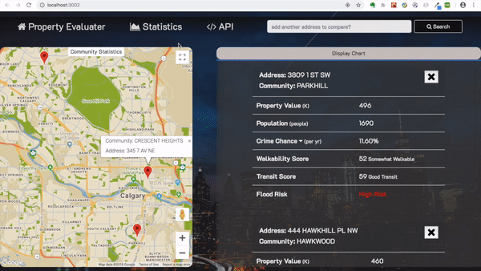
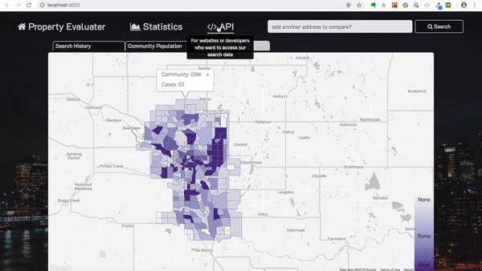
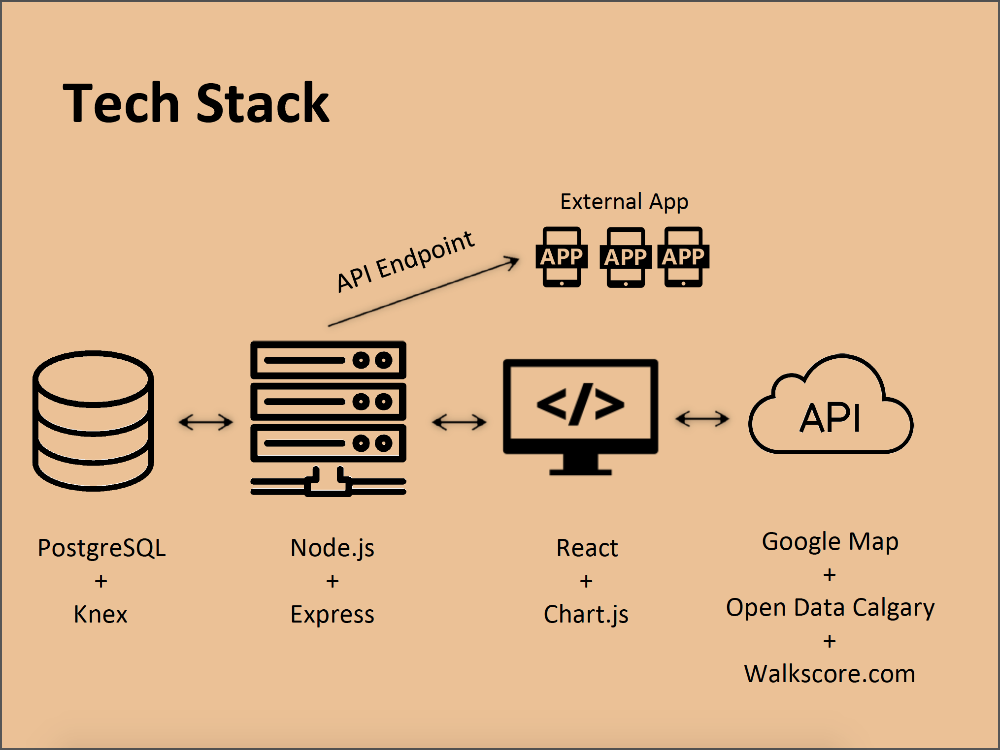

# Property Evaluator
Property Evaluator is a data visualization and comparison application, servering potential real estate investor located in Calgary, AB, Canada. Property Evaluator utilize City of Calgary offical open data and walkscore.com API to provide user with actual, realtime information about any specific residential/commercial property in Calgary. Property Evaluator also use big data approach to collect anonymous data about searching preference. No personal information is involved or collected when using Property Evaluator. This application also provide a open API endpoint for external application to query our database

## User Story
### As a User
1. As a user, you will be able to search real estate properties in Calgary, and obtain information about:
  * Where this property is located within the city
  * Property value in the last 5 years, assessed by city of Calgary
  * Community population and its trending for 5 years
  * Crime chances and breakdown of different categories
  * Walkability and transit score
  * potential flood risk alert
2. All the infomation obtained above can be viewed in either table or chart, providing cross-comparison between properties and between different years.
3. As a user, you are able to view community statistics on a choropleth map if you are looking for general information about Calgary. Information provided in choropleth map includes:
  * Search history - How many time a community has been search
  * Population - How many people lives in this community
  * Crime case - How many crime cases happens in a certain community

### As a Developer
1. As a developer, you will be able to use our open API endpoint to query specific part of our database using filter function that provided in the API document

## Live Demo
1. When user enter an address on the search bar, Property Evaluator provide detailed information about the property, including where it is located on the map <br/>


2. When user adding additional address, information will slide in on top of the first address, allow comparison between different properties <br/>


3. User can view property value trending and community population trending in the form of chart. This allow user to see the overall trending of property as well as comparison between different properties <br/>
 

4. When user choose to see communitity statistics, choropleth map with 3 options is displayed <br/>


5. Developer can follow API documentation to set request to our API endpoint and collect information <br/>


## Tech Stack
PostgreSQL | Node.js | Express | React <br/>


## Getting Started
Running this application on your machine requrire Node.js, npm and PostgreSQL installed
1. Clone this repository to your local
2. Install all necessary dependencies
```
npm install
cd server
npm install
```
3. Seeding database
in server/db
```
ndoe seed.js
```
visit localhost:8080 to seed your local database

4. Start Express and React Server
```
cd ..
node server.js
cd ..
npm start
```

## Dependencies
### React Dependencies
    "axios": "^0.18.0",
    "chart.js": "^2.7.3",
    "react": "^16.5.2",
    "react-chartjs-2": "^2.7.4",
    "react-dom": "^16.5.2",
    "react-load-script": "0.0.6",
    "react-scripts": "2.0.5"
### Express Dependencies
    "body-parser": "^1.18.3",
    "dotenv": "^6.1.0",
    "express": "^4.16.4",
    "knex": "^0.15.2",
    "knex-logger": "^0.1.0",
    "morgan": "^1.9.1",
    "pg": "^7.5.0"